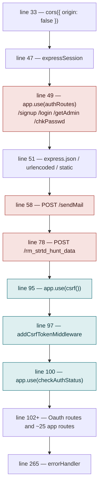

# R-Land Hunt — Architecture Teardown

A GPS-geofenced scavenger hunt platform built for IIT Roorkee clubs. Express/EJS monolith with a
WebSocket leaderboard, a Leaflet map picker, and a game engine that runs entirely in the
participant's browser.

| | |
|---|---|
| **Repository** | `charizard00001/R-Land-Hunt` @ `e18567b` |
| **Origin** | [`MDGSpace-SoC-2023/capsule-corporation`](https://github.com/MDGSpace-SoC-2023/capsule-corporation) |
| **Built** | Dec 2023 – Jan 2024 |
| **Source size** | ~1,900 lines (excluding committed `node_modules`) |
| **Deployment** | Offline — `rlandhunt.onrender.com` returns 404 |

> **Note on secrets.** This document deliberately does **not** reproduce the literal credential
> values that are committed to this repository. It gives their `file:line` locations so they can be
> found and rotated. See [F-01](#f-01--five-live-credentials-are-committed-to-a-public-repository).

---

## Contents

1. [What it actually is](#1--what-it-actually-is)
2. [The product model](#2--the-product-model)
3. [Stack and repository layout](#3--stack-and-repository-layout)
4. [The request pipeline](#4--the-request-pipeline)
5. [Route catalogue](#5--route-catalogue)
6. [Data model](#6--data-model)
7. [The game engine](#7--the-game-engine)
8. [Realtime layer](#8--realtime-layer)
9. [Identity and access](#9--identity-and-access)
10. [Findings](#10--findings)
11. [Dead code and vestigial paths](#11--dead-code-and-vestigial-paths)
12. [If you were to revive it](#12--if-you-were-to-revive-it)

---

## 1 · What it actually is

R-Land Hunt solves a logistics problem, not a software one. Clubs at IIT Roorkee ran treasure hunts
by taping QR codes to physical locations and stationing a volunteer at each one — which created
queues and bottlenecks at every clue site.

The app replaces the QR code and the volunteer with a geofence. A participant reaches a location,
taps **Check My Location**, and the browser's Geolocation API is compared against coordinates the
organiser dropped on a map beforehand. If they're inside the radius, the next clue unlocks. No
volunteer, no queue.

### Provenance

This repository is not where the code was written. It is a squashed import of
`MDGSpace-SoC-2023/capsule-corporation`, a team project built for MDG Space's Season of Code 2023.
The real history lives upstream: **34 commits between 10 December 2023 and 31 January 2024**, by
**kartik-ag** (25 commits) and **Shashankiitr** (9, almost entirely CSS and responsiveness). This
copy holds three commits — the import, a deployment note, and a README link.

The upstream commit messages read as a clean feature ledger:

```
with login → admin-client connection done → Leaderboard done → registerations done
→ end and pause a hunt functionality → edit completed → emails → for deploy
```

Roughly seven weeks, feature by feature, with a deploy at the end.

### Current status

The hosted instance at `rlandhunt.onrender.com` returns **404** — the Render service is gone. The
demo video and the README link are the only surviving record of it running. Nothing in the repo has
been touched since May 2024.

---

## 2 · The product model

Two roles share one login. After authenticating with an enrollment number, a user picks
**Participant** or **Admin** on an identity-selection screen. Admin additionally prompts for a
shared password.

### Lifecycle of a hunt

| Phase | Actor | What happens | Persisted to |
|---|---|---|---|
| **Author** | Admin | Names the hunt, sets a clue count, then fills a clue / location / hint triple per stop. Location is picked by clicking a Leaflet map centred on the IIT Roorkee campus. | `hunts`, `upcominghunts` |
| **Register** | Team captain | Submits team name plus 2+ members (name, enrollment no., phone, email). Validated for duplicates within the team and against every other team. | `<huntname>` |
| **Start** | Admin | Selects the hunt and starts it. Registration closes. A 10-minute countdown begins in the admin's browser and a WebSocket broadcast flips waiting participants into the live view. | `startedHunts` |
| **Play** | Team | Enters the hunt by team name, receives clue 1, walks to each location, taps to verify, optionally buys hints. | `enteredinto_<huntname>` |
| **End** | Admin / timer | Admin ends the hunt, or the countdown expires. All clients are told to stop; the started-hunt record is dropped. | — (collections dropped) |

### Scoring rules

These are the complete rules, and all four live in `public/scripts/clues.js`:

| Event | Δ Score | Mechanism |
|---|---:|---|
| Reach a geofence | **+100** | `simulateNextClueOpening()` |
| Complete the final clue | **+200** | `checkGeofence()` terminal branch |
| Reveal a hint (once per clue) | **−50** | `toggle()`, guarded by `flag` |
| Every 30 seconds elapsed | **−1** | `setInterval(…, 30000)` |

The time decay is floored at zero (`if (score > 0)`) but hint penalties are not, so a team that
opens hints without reaching locations can go negative. Completion also fires a congratulations
email to the captain's address.

---

## 3 · Stack and repository layout

| Layer | Choice |
|---|---|
| **Runtime** | Node.js, single process, port 3000 hardcoded. No `start` script, no `engines` field. |
| **Server** | Express 4 + `http.createServer`, so the HTTP server and the `ws` WebSocket server share one listener. |
| **Views** | EJS, server-rendered. 28 templates, 4 shared partials. |
| **Database** | MongoDB via the native driver (no Mongoose). Connection string `mongodb://0.0.0.0:27017`, database `hunt`. |
| **Sessions** | `express-session` persisted with `connect-mongodb-session`. |
| **Client JS** | No framework, no build step. Plain scripts in `public/scripts/`, plus Leaflet 1.5.1 and jQuery 3.6.4 from CDNs. |
| **Maps** | Leaflet with OpenStreetMap tiles; picker centred on `29.86499676, 77.89658009` at zoom 18. |
| **Email** | Nodemailer over Gmail SMTP. |

### Dependencies declared

Thirteen packages, three of which do nothing. `geolocation@0.0.0` is required into a misspelled
binding (`geolaocation`) and never referenced — all location work uses the browser's native API.
`body-parser` is applied per-route even though the identical `express.json` / `express.urlencoded`
middleware is already global. `csurf` is used, but has been formally deprecated and unmaintained
since 2022.

### Directory map

```
index.js              402 lines — entrypoint, ~30 inline routes, WebSocket hub
config/session.js            session store + cookie config
data/database.js             MongoClient singleton, getDb() accessor
models/                      3 classes wrapping raw driver calls
  user.model.js              signup / lookup / bcrypt compare
  team.model.js              Team + participantDataSet, duplicate lookups
  hunt.model.js              Hunt + dataSet, 6 persistence variants
controllers/                 7 controllers, one per screen family
middlewares/                 check-auth, csrf-token, error-handler
util/                        session helpers, flash-message helpers
routes/                      auth.routes.js, Oauth.routes.js
views/                       28 EJS templates + includes/
public/CSS/                  17 stylesheets, one per screen
public/scripts/              9 client scripts (2 empty)
node_modules/                committed — 5,368 files, 121 packages
```

The separation is genuinely clean for a student project: models hold persistence, controllers hold
flow, middlewares are small and single-purpose. The erosion is in `index.js`, which accumulated
roughly thirty route definitions inline rather than delegating to `routes/`.

---

## 4 · The request pipeline

Everything about this application's security posture is decided by the order of about fifteen lines
in `index.js`. Express applies middleware in registration order, and **three routes plus an entire
router are mounted _before_ the CSRF and authentication layers.**



Everything in the red band is registered **before** the guards and is therefore unauthenticated and
unprotected against CSRF.

The consequence is visible in the templates themselves: `views/login.ejs` has no `_csrf` hidden
input at all, and `views/admin.ejs` has one that was commented out. Those forms sit outside the CSRF
layer, so a token there would have been rejected as unexpected.

### The second half of the problem

`checkAuthStatus` only **sets** `res.locals.isAuth`. It never blocks. Each route is expected to
check the flag itself — and the page-rendering routes do
(`if (res.locals.isAuth) … else res.redirect('/index')`), but the routes that _mutate hunts_ do not.

`/savehunt`, `/editing`, `/appending`, `/deleting`, `/deleting2`, `/modifying`, `/strthunt`,
`/starthunt`, `/starter` and `/edit` perform **no authorisation check whatsoever**.

---

## 5 · Route catalogue

Complete surface, in registration order. **Auth** means a session check exists in the handler;
**CSRF** means the route sits after the `csrf()` layer.

| Method | Path | Handler | Auth | CSRF | Notes |
|---|---|---|---|---|---|
| GET | `/signup` | `auth.getSignup` | n/a | ❌ | Registration form |
| POST | `/signup` | `auth.signup` | n/a | ❌ | bcrypt cost 12 |
| GET | `/login` | `auth.getLogin` | n/a | ❌ | — |
| POST | `/login` | `auth.login` | n/a | ❌ | Sets `session.uid` |
| GET | `/getAdmin` | `auth.getAdminCheck` | ❌ none | ❌ | Admin password prompt |
| POST | `/chkPasswd` | `auth.checkAdminPasswd` | ❌ none | ❌ | Compares to a literal; **stores nothing** |
| POST | `/sendMail` | inline | ❌ none | ❌ | Passes `req.body` straight to Nodemailer |
| POST | `/rm_strtd_hunt_data` | inline | ❌ none | ❌ | Drops `startedHunts`; never responds |
| GET | `/auth` | Oauth router | n/a | ✅ | Redirect to Channel-i |
| GET | `/callback` | Oauth router | n/a | ✅ | Never sends a response — hangs |
| GET | `/` `/index` `/identity` | inline | ✅ | ✅ | Landing and role selection |
| GET | `/menu` | inline | ⚠️ isAuth only | ✅ | **Admin console — any logged-in user** |
| GET | `/menu_client` | inline | ✅ isAuth | ✅ | Participant menu |
| GET | `/huntinfo` | inline | ⚠️ isAuth only | ✅ | Hunt authoring + map picker |
| POST | `/savehunt` | `huntinfo.storeData` | ❌ none | ✅ | Creates/edits hunts; branches on a `route` field |
| GET | `/starter` | `starthunt.loadnames` | ❌ none | ✅ | — |
| POST | `/strthunt` | `starthunt.loadHunt` | ❌ none | ✅ | Renders all clues + coordinates for review |
| POST | `/starthunt` | `starthunt.startHunt` | ❌ none | ✅ | Opens the admin console |
| GET | `/starter2` | `enterhunt.loadnames` | ❌ none | ✅ | — |
| POST | `/strthunt2` | `enterhunt.enterHunt` | ❌ none | ✅ | **Ships every clue, hint and coordinate to the browser** |
| GET | `/team_members` | `team.loadnames` | ❌ none | ✅ | Registration form |
| POST | `/registerteam` | `team.storeData` | ❌ none | ✅ | The most thoroughly validated handler in the codebase |
| GET | `/edit` | `edithunt.loadnames` | ❌ none | ✅ | — |
| POST | `/edthunt` | `edithunt.loadhunt` | ❌ none | ✅ | — |
| POST | `/editing` | `edithunt.completeEdit` | ❌ none | ✅ | — |
| POST | `/appending` | `edithunt.addClues` | ❌ none | ✅ | ⚠️ broken on Linux |
| POST | `/deleting` | `edithunt.deleteClues` | ❌ none | ✅ | ⚠️ broken on Linux |
| POST | `/deleting2` | `edithunt.deleteHunt` | ❌ none | ✅ | Drops 2 collections, deletes 2 docs |
| POST | `/modifying` | `edithunt.modify` | ❌ none | ✅ | — |
| POST | `/endHunt` | inline | ❌ none | ✅ | ⚠️ always 500s — calls `db.collection` |
| POST | `/logout` | `auth.logout` | n/a | ✅ | Nulls `uid`; does not destroy the session |
| GET | `/upcomings` `_adrights` `_client` | `upcomings.*` | ❌ none | ✅ | Three near-identical handlers |
| GET | `/clues` `/hunt2` `/addClues` `/deleteClues` `/modify` `/start` `/bstart` `/alregis` `/unreg` | inline renders | ⚠️ mixed | ✅ | Static shells |

---

## 6 · Data model

Five fixed collections, plus **two dynamically-named collections per hunt**. There are no indexes,
no schema validation and no unique constraints anywhere — every uniqueness rule is enforced in
application code by querying first.

| Collection | Shape | Written by |
|---|---|---|
| **`users`** | `{ enrollementNo, password }` | Signup. Password is a bcrypt hash, cost 12. |
| **`hunts`** | `{ huntname, data: [ { clue, location, hint } ] }` | Hunt authoring. `location` is the _string_ `"lat, lng"` at 12 decimal places. |
| **`upcominghunts`** | `{ huntname }` | A name-only index used to populate every dropdown. |
| **`startedHunts`** | `{ huntname }` | Presence acts as the "registration closed" flag. Dropped wholesale on end. |
| **`sessions`** | connect-mongodb-session | Session store. |
| **`<huntname>`** | `{ teamname, teamdata: [ { name, enrollentNo, phoneNo, email } ] }` | Team roster. **Collection is named after user input.** |
| **`enteredinto_<huntname>`** | `{ teamname }` | One-way ledger preventing re-entry. |

### Collection names come from the request body

`db.getDb().collection(req.body.huntname)` appears in the team model and both hunt controllers with
no validation. Creating a hunt named `users` makes team registrations write documents into the users
collection; a hunt named `sessions` writes into the session store. `deleteHunt` then calls `.drop()`
on that same attacker-chosen name.

### A field-name inconsistency worth knowing about

The user model stores `enrollementNo`; the participant model stores `enrollentNo`. Both are
misspellings of "enrolment", but they are _different_ misspellings. Queries are internally
consistent — the team lookups use `enrollentNo` and match what the team writer produced — so nothing
breaks today, but the two collections cannot be joined on that field without a translation step.

### A persistence path that works by accident

The **Delete Clues** flow routes through `storeData`'s `/deleting` branch, which calls `hunt.Save()`
— an `insertOne` — and then `hunt.SaveDeletedHunt()`, a `deleteOne` matching the same `huntname`.
For a moment two documents share the name; the delete removes whichever the driver returns first,
which in practice is the original. The net effect is a replace, achieved without `replaceOne` and
dependent on natural document order.

---

## 7 · The game engine

**There is no server-side game engine.** Scoring, geofence validation, clue advancement and
completion detection all execute in the participant's browser, in one 190-line file.

### What the server sends on entry

`enterHunt` loads the hunt document and passes `clues`, `hints` and `locations` — all of them, for
every stop — into `views/clues.ejs`, which serialises them into inline script variables:

```js
myLocations = "<%= locations %>";   // "29.865…, 77.896…,29.867…, 77.898…"
myClues     = "<%= clues %>";       // every clue text, comma-joined
myHints     = "<%= hints %>";       // every hint text, comma-joined
```

A participant who opens View Source at the start of the hunt has the complete solution: every clue,
every hint, every coordinate. The 100-point rewards and 50-point hint penalties are metered by a
script that the same participant can edit in the console.

> **The comma problem.** Arrays are flattened to strings and re-split on `","`. Any clue or hint
> containing a comma — ordinary English punctuation — splits into extra array entries and
> desynchronises clues from their locations for the remainder of the hunt. Coordinates survive only
> because they are re-paired two-at-a-time afterwards.

### Geofence check

`checkGeofence()` uses a textbook haversine against an earth radius of 6371 km and compares the
result to a constant:

```js
const geofenceRadius = 10; // in kilometers
if (distance <= geofenceRadius) { i++; simulateNextClueOpening(); }
```

Ten kilometres. The comment is accurate and the unit is right — the value is simply three orders of
magnitude too large for the use case.

| Measurement | Distance |
|---|---|
| Configured geofence | **10.0 km radius** |
| IIT Roorkee campus | ≈ 1.5 km across |
| Roorkee town | ≈ 5 km across |
| **Effect** | **Always inside** |

Every clue in a campus hunt validates from every other point in the hunt — and from a participant's
hostel bed. The location restriction that is the product's entire premise does not constrain
anything. A radius in the 20–50 metre range is what the mechanic needs; `10` would become `0.02`.

### The final clue is never checked

The terminal branch fires on `i == myClues.length - 1` — that is, when the index has advanced _to_
the last clue, before that clue's own location is compared. For a three-stop hunt the engine
verifies stops 1 and 2, displays stop 3, then awards the 200-point completion bonus on the next tap
regardless of where the participant is standing.

---

## 8 · Realtime layer

A single `ws` server shares the HTTP listener. It is a **global broadcast bus** — no rooms, no
per-hunt channels, no authentication on the socket, and no association between a connection and a
team. Only two pages ever open a socket: `clues.ejs` (participants, via `client.js`) and
`hunt2.ejs` (the admin console, via `admin.js`).

| Direction | Message | Server behaviour |
|---|---|---|
| admin → | `['Serve', huntname]` | Broadcasts `['startedAdminPages', huntname]`; caches it as `lastMessage` and replays it to late joiners. |
| any → | `'requestLeaderboard'` | Broadcasts `'giveScores'` to everyone. |
| admin → | `'requestLeaderboardForAdmin'` | Broadcasts `'giveScoresToAdmin'`. Fired on a 5-second interval. |
| client → | `['Score', score, teamname]` | Pushes onto an array. **When length equals the connection count**, sorts descending and broadcasts `['scores', …]`, then clears. |
| admin → | `'pause'` / `'resume'` | Broadcasts verbatim to all clients. |
| admin → | `'endHunt'` | Sets `isFinished`; broadcasts `'endHunt'`. |
| ← close | (disconnect) | Broadcasts `'stoppedAdminPages'` to everyone still connected. |

### Four ways the leaderboard fails

**The barrier never clears.** Scores are only published once `scores.length == wss.clients.size`.
Any connection that does not answer — a second tab, a client mid-navigation, a socket that has not
yet closed — makes the condition unreachable. Worse, the array is never cleared on a failed round,
so the stale entries poison every subsequent request permanently.

**One participant leaving blanks everyone's screen.** The `close` handler broadcasts
`'stoppedAdminPages'` to _all_ clients, and `client.js` responds by hiding the hunt view and showing
"Hunt has not started yet!". A single team closing a tab resets the display for every other team in
the hunt.

**Concurrent hunts collide.** `startedAdminPages` carries a hunt name and clients filter on it — but
`endHunt`, `pause`, `resume` and the score requests carry no hunt identity and are not filtered. An
organiser ending hunt A ends hunt B for everybody.

**The admin appears on the leaderboard.** `admin.js` answers score requests with
`['Score', 0, 'admin']` so the barrier count can be met, which puts a team called "admin" with zero
points into every published standing.

### The realtime layer could never have worked in production

Both `client.js` and `admin.js` open `new WebSocket('ws://localhost:3000')` — a hardcoded literal.
On the deployed Render instance that address resolves to the participant's own machine, and an
insecure `ws://` connection from an `https://` page is blocked as mixed content regardless. The
leaderboard, the pause/resume controls and the start broadcast worked on the development laptop and
nowhere else.

### The countdown

The 10-minute timer is a hardcoded constant in `views/hunt2.ejs`, counted down by `setInterval` in
the admin's browser. It is not authoritative and not shared: refreshing the admin page restarts it,
and participants never see it. When it reaches zero it calls `endHunt()`, which posts to
`/rm_strtd_hunt_data`. The same timer logic exists a second time in the orphaned
`public/scripts/hunt.js`.

---

## 9 · Identity and access

### What works

Passwords are hashed with bcrypt at cost 12 and compared with `bcrypt.compare` — correct, and
stronger than the default many projects settle for. Sessions are persisted in MongoDB rather than
held in memory, so they survive a restart. The flash-message pattern for re-populating forms after a
validation failure is cleanly implemented.

### The admin gate

```js
if (passwd === '<REDACTED — see controllers/auth.controller.js:116>') {
    res.redirect('/menu');
}
```

This is the entire admin authorisation model. A shared literal, compared, and on success — a
redirect. **Nothing is written to the session.** There is no `req.session.isAdmin`, and no route
ever asks whether the visitor passed this check. `/menu` tests only `res.locals.isAuth`, which is
true for any logged-in participant; the hunt-mutation routes behind it test nothing at all.

Typing `/menu` into the address bar reaches the organiser console directly. The password gates a
redirect, not access.

### Logout

`destroyUserAuthSession` sets `req.session.uid = null` and returns. The session record is not
destroyed and the identifier is not regenerated, so the cookie remains valid and the row remains in
the store. Combined with the absence of `secure` and `sameSite` on the cookie and a hardcoded
session secret in `config/session.js:16`, session handling is the weakest part of an otherwise
reasonable auth implementation.

### The abandoned Channel-i integration

The trailing comment in `index.js` — `// channel i authentication // edit hunt` — is a to-do list,
and the first item was never finished. IIT Roorkee's Channel-i portal offers OAuth, which would have
authenticated students by their real institute identity instead of a self-declared enrollment
number.

What exists: `/auth` redirects to the Channel-i authorise endpoint correctly. `/callback` receives
the code, logs it, and calls —

```js
function getAccessToken(code) {

}
```

— an empty function. The handler then falls off the end without calling `res.send` or
`res.redirect`, so the browser hangs until it times out. A parallel, equally unfinished attempt
lives in `public/scripts/auth.js`, which runs client-side and posts the token request from the
browser.

That file is loaded by `views/index.ejs`, so **every visit to the landing page** fires an
`XMLHttpRequest` to `http://channeli.in/open_auth/token/` carrying the OAuth client secret, with a
garbage authorisation code parsed from an empty query string.

---

## 10 · Findings

Ranked by severity. Everything below was read directly from the source; the two marked **verified**
were reproduced against the working tree.

### F-01 · Five live credentials are committed to a public repository
`CRITICAL` — `index.js:64–65` · `routes/auth.routes.js:24–25` · `routes/Oauth.routes.js:17–18` · `public/scripts/auth.js:4–5` · `public/scripts/auth1.js:1` · `controllers/auth.controller.js:116` · `config/session.js:16`

A Gmail address and its 16-character app password; a Channel-i OAuth client ID and client secret (in
three files, one of which is **served to every browser** as a static asset); the shared admin
password; and the session signing secret. All are in the public git history of a repository that has
been public since May 2024, so rotation — not deletion — is the only remedy. **The Gmail app
password should be revoked first:** it grants send access to a real mailbox.

### F-02 · `/sendMail` is an unauthenticated open mail relay
`CRITICAL` — `index.js:58–76`

The handler assigns `req.body` directly to Nodemailer's `mailOptions` and sends. No authentication,
no CSRF, no allow-list, no validation of any field. Any party on the internet could POST arbitrary
`from`, `to`, `subject` and `html` and have it delivered through the project's Gmail account — spam
and phishing sent from a real, reputable address. The route also never responds, so the caller's
request hangs.

### F-03 · The admin password authorises nothing
`CRITICAL` — `controllers/auth.controller.js:104–126` · `index.js:123–129`

`checkAdminPasswd` compares the submitted value and redirects to `/menu` on success without
recording anything in the session. `/menu` and the authoring screens check only
`res.locals.isAuth`, and the routes that create, edit, start and delete hunts check nothing. Any
registered participant — or, for the mutation routes, any visitor holding a CSRF token — has full
organiser capability, including deleting a hunt and its team roster.

### F-04 · `/rm_strtd_hunt_data` drops a collection for anyone who asks
`CRITICAL` — `index.js:78–93`

Registered before both the CSRF and auth layers. It calls `.drop()` on `startedHunts` and deletes an
`upcominghunts` document named by the request body. A single unauthenticated POST terminates any
running hunt and removes it from every dropdown. It sends no response.

### F-05 · Every clue, hint and coordinate is delivered to the participant up front
`CRITICAL` — `controllers/enterhunt.controller.js:55–77` · `views/clues.ejs:58–89`

The full solution is embedded in the page source the moment a team enters. Combined with F-06 —
scoring held in a mutable browser variable — the hunt has no integrity model at all. Clues should be
issued one at a time from the server, and the score should be server-authoritative.

### F-06 · Scores are self-reported by the client
`CRITICAL` — `public/scripts/client.js:98–108` · `public/scripts/clues.js`

`score` is a plain `let` in page scope, incremented by client code and transmitted to the
leaderboard on request. `score = 99999` in the console wins the hunt. The server never computes,
validates or stores a score — no score is persisted anywhere.

### F-07 · The 10 km geofence makes location checks unconditional
`CRITICAL` — `public/scripts/clues.js:114`

`geofenceRadius = 10` kilometres against a campus 1.5 km across. Every stop validates from
everywhere in town, which defeats the product's founding premise. The fix is one number: `0.02` for
a 20-metre fence, ideally validated server-side.

### F-08 · Collection names are taken from unvalidated user input
`HIGH` — `models/team.model.js:11–56` · `controllers/enterhunt.controller.js:26` · `controllers/edithunt.controller.js:102–112`

`collection(huntname)` and `collection('enteredinto_' + huntname)` with no allow-list. A hunt named
after an existing collection redirects writes into it, and `deleteHunt` will `.drop()` whatever name
it is handed. Hunts should carry an ObjectId and teams should live in one collection keyed by it.

### F-09 · Any team can be locked out of a hunt by name
`HIGH` — `controllers/enterhunt.controller.js:31–47`

`enterHunt` writes the submitted team name into `enteredinto_<hunt>` _before_ checking that the team
is registered. Submitting a rival's team name marks it entered permanently; the real team then
receives "Re-Entry is not allowed" and cannot play. The ledger write must happen after validation,
and entry must be tied to an authenticated identity rather than a typed string.

### F-10 · Add Clues and Delete Clues are broken on any Linux host
`HIGH` — `controllers/edithunt.controller.js:58, 73`

The handlers call `res.render('addclues')` and `res.render('deleteclues')`, but the templates are
`views/addClues.ejs` and `views/deleteClues.ejs`. Case-insensitive filesystems on Windows and macOS
resolve this; Linux does not, so both flows return **500 Something broke!** on the deployed instance
while working perfectly in development. A textbook works-on-my-machine failure.

### F-11 · Authentication routes sit outside CSRF protection
`HIGH` — `index.js:49` vs `index.js:95`

`authRoutes` is mounted 46 lines before `app.use(csrf())`, leaving `/signup`, `/login`, `/getAdmin`
and `/chkPasswd` unprotected — which is why `views/login.ejs` carries no token and `views/admin.ejs`
has its token commented out. Separately, `csurf` itself has been deprecated and unmaintained since
2022 and should be replaced outright.

### F-12 · `.gitignore` is UTF-16 encoded and ignores nothing — **verified**
`HIGH` — `.gitignore`

The file begins with a UTF-16LE byte-order mark (`ff fe`) and stores `.env` as wide characters. Git
parses `.gitignore` as bytes, so the rule never matches. Creating a `.env` in the working tree and
running `git check-ignore` confirms it: exit code 1, and the file appears as untracked in
`git status`. No secret has leaked through this path only because the team never created a `.env` —
they hardcoded the values instead. Rewriting the file as ASCII is a one-line fix that becomes urgent
the moment F-01 is remediated properly.

### F-13 · The WebSocket leaderboard deadlocks and cross-talks
`HIGH` — `index.js:282–400` · `public/scripts/client.js` · `public/scripts/admin.js`

Four compounding defects, detailed in §8: the `scores.length == clients.size` barrier is unreachable
if any socket stays silent and is never reset; the `close` handler blanks every participant's screen
when one leaves; control messages carry no hunt identity so concurrent hunts interfere; and the
admin injects a zero-score row. Rooms keyed by hunt, a timeout on score collection, and server-held
scores resolve all four.

### F-14 · Realtime is hardwired to `localhost`
`HIGH` — `public/scripts/client.js:1` · `public/scripts/admin.js:3`

`new WebSocket('ws://localhost:3000')`. In any deployment this points at the visitor's own machine,
and mixed-content rules block `ws://` from an HTTPS page regardless. Derive it:

```js
new WebSocket(`${location.protocol === 'https:' ? 'wss' : 'ws'}://${location.host}`)
```

### F-15 · The final clue's location is never verified
`MEDIUM` — `public/scripts/clues.js:88–111`

The completion branch triggers on `i == myClues.length - 1`, which is reached when the last clue is
_displayed_, not when its location is checked. The 200-point bonus is awarded on the next tap from
any location.

### F-16 · Logout does not end the session
`MEDIUM` — `util/authentication.js:6–8`

Setting `req.session.uid = null` leaves the session document in Mongo and the cookie valid. Use
`req.session.destroy()`, and regenerate the session on login to close the fixation window. The
cookie also needs `secure` and `sameSite`, and the secret must move to an environment variable.

### F-17 · Clues remain editable while a hunt is running
`MEDIUM` — `controllers/huntinfo.controller.js:21–38`

The README states that clue changes are restricted once the hunt begins. `deleteHunt` and team
registration do check `startedHunts` — but `/savehunt`'s `editing`, `appending` and `modifying`
branches do not, so an organiser can rewrite clues under teams already playing. Documented behaviour
and actual behaviour disagree.

### F-18 · `POST /endHunt` throws on every call — **verified**
`MEDIUM` — `index.js:252`

It calls `db.collection('startedHunts')`, but `db` is the module exporting
`{ connectToDatabase, getDb }` — the accessor is `db.getDb().collection(…)`, used correctly on lines
80, 86 and 132. This one line raises a `TypeError`. The route is unreachable in practice: the admin
console posts to `/rm_strtd_hunt_data` instead, and the End Hunt form targets `/endingHunt`, which
does not exist and 404s.

### F-19 · Comma-containing clue text corrupts the hunt
`LOW` — `views/clues.ejs:79–85`

Arrays are joined into strings by EJS interpolation and re-split on commas in the browser. Ordinary
punctuation in a clue desynchronises clues from hints and locations for the rest of the run.
Serialising with `JSON.stringify` — or better, not shipping the array at all per F-05 — removes the
class of bug.

### F-20 · No database constraints back the application's uniqueness rules
`LOW` — `models/*.js`

Enrollment numbers, team names, emails and phone numbers are all checked with a find-then-insert,
which races under concurrency — precisely the condition a registration deadline creates. Unique
indexes would make the guarantees real. There are no indexes of any kind, so every duplicate check
is a collection scan.

---

## 11 · Dead code and vestigial paths

| Item | State |
|---|---|
| `views/edit.ejs` | Zero bytes. `/edit` renders `editadrights` instead. |
| `views/hunt.ejs` | Orphan. Links to `stop_hunt.html` (does not exist) and `/CSS/upcoming.css` (the file is `upcomings.css`). Superseded by `hunt2.ejs`. |
| `views/stop_hunt.ejs` | Never rendered by any route. |
| `public/scripts/hunt.js` | Duplicate countdown, orphaned — the live copy is inline in `hunt2.ejs`. |
| `public/scripts/upcomings.js` | Empty file. |
| `public/scripts/team_members.js` | Empty file, still loaded by the registration page. |
| `public/scripts/auth.js` | Half-built OAuth client. Loaded on the landing page, fires a token request with the client secret on every visit. |
| `public/scripts/auth1.js` | Channel-i redirect helper. Its only caller is commented out in `index.ejs`. |
| `starthunt.controller.endHunt` | Empty function body, exported, never routed. |
| `team.controller.getTeamMembers` | References an undefined `sessionData`; would throw. Never routed. |
| `geolocation@0.0.0` | Required as `geolaocation`, never used. |
| `upcomings.controller` | Three handlers differing only in template name. |
| cors config | `origin: false` app-wide, then `origin: 'http://localhost:3000'` in `authRoutes`; `referer: "*"` is not a valid option. |
| `node_modules/` | Committed — 5,368 files across 121 packages. |
| `console.log` | Left throughout, including one that prints every CSRF token to the server log. |

---

## 12 · If you were to revive it

The architecture is sound enough to build on — the problem is that the trust boundary sits in the
wrong place. Almost every serious finding traces to one decision: **the game runs in the browser and
the server takes its word for the result.**

### Do first, before anything else

1. **Revoke the Gmail app password** in the Google account's security settings, and rotate the
   Channel-i OAuth secret with MDG Space. Both are public and have been for over two years.
2. **Rewrite `.gitignore` as ASCII** — it currently protects nothing (F-12).
3. **Delete `/sendMail` and `/rm_strtd_hunt_data`**, or move them behind auth. If the repo is ever
   redeployed as-is, these are live.

### Then move the trust boundary

4. **Issue one clue at a time.** An endpoint that returns clue _n_ only once the server has verified
   arrival at clue _n−1_. This deletes F-05 and F-19 outright.
5. **Verify position server-side.** Post latitude and longitude; run the haversine on the server
   against a radius of ~20 m; return pass or fail. The client keeps the map and the button, nothing
   else.
6. **Keep score in Mongo.** Award points on verified arrival, deduct on hint issuance, decay by
   elapsed time computed from a stored start timestamp. The leaderboard becomes a query, which
   retires the entire broadcast-barrier mechanism and F-06, F-13 and most of F-14 with it.
7. **Store a role on the session.** `req.session.role = 'admin'` after the password check, plus a
   `requireAdmin` middleware applied to every mutation route (F-03).

### Then the structural cleanup

8. Move the `csrf()` and auth layers above _all_ route registration, and swap deprecated `csurf` for
   a maintained alternative.
9. Give hunts an ObjectId; put every team in one `teams` collection keyed by it. Add unique indexes
   for enrollment number, team name per hunt, email and phone (F-08, F-09, F-20).
10. Move the connection string, session secret and mail credentials into environment variables —
    `dotenv` is already a dependency and already loaded.
11. Derive the WebSocket URL from `location`, and scope connections to a hunt room (F-14, F-13).
12. Fix the two lowercase `res.render` calls before any Linux deploy (F-10), and correct
    `db.collection` on line 252 (F-18).
13. Lift the ~30 inline routes out of `index.js`, delete `node_modules` from version control, and
    add a `start` script and an `engines` field.

---

None of this is a rewrite. The MVC separation, the model classes, the flash-message pattern, the
Leaflet picker and the registration validator — which checks four fields for duplicates both within
a team and across every other team — are all worth keeping. The work is relocating the game loop
from the browser to the server, and putting a real authorisation check where a redirect currently
stands.
