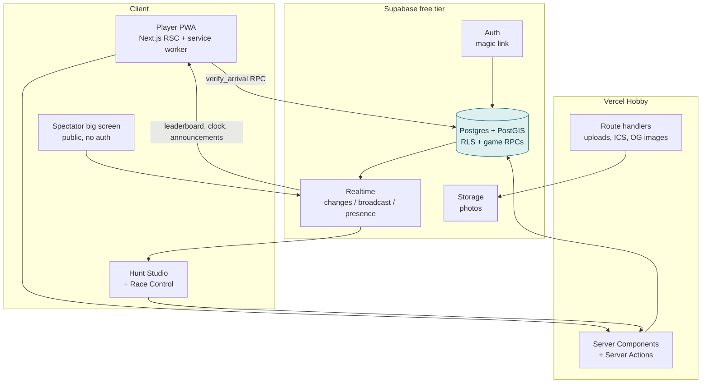

# R-Land Hunt 2.0 — Rebuild Plan

**Status:** proposal for review · **Date:** 27 August 2026 · **Scope:** full rebuild of `charizard00001/R-Land-Hunt` @ `be51f1a`
**Companion doc:** [`ARCHITECTURE-TEARDOWN.md`](./ARCHITECTURE-TEARDOWN.md) — the forensic read of v1 that this plan answers.

---

## 0 · The thesis in one paragraph

v1 was a good idea with the trust boundary in the wrong place. The game ran in the participant's
browser and the server took its word for the result — which is why almost every finding in the
teardown collapses into one sentence. **v2 moves the entire game loop into the database.** A clue is
a row the player is not permitted to read until a Postgres function has verified they physically
stood within metres of it. Score is a server-computed integer. The client becomes what it should
always have been: a map, a button, and a very good-looking scoreboard.

Everything else in this plan — graph-shaped hunts, race control, power-ups, the replay — is built on
that single structural change, and none of it costs money.

---

## 1 · What v2 is, and how the ambition changes

**v1's scope:** one club, one hunt at a time, one shared admin password, a linear list of clues, and
a leaderboard that only ever worked on the developer's laptop.

**v2's scope:** *a hunt platform any campus club can run, on free infrastructure, for a 200-person
event, with no volunteer standing at any clue.*

| | v1 | v2 |
|---|---|---|
| **Tenancy** | one implicit organisation | **Orgs** — each club owns its hunts, members, templates and past results |
| **Hunt shape** | linear array of clues | **Directed graph** — branches, parallel legs, optional stops, "any 3 of 5" gates |
| **Play model** | reach location → next clue | reach location → **prove it** → next node, inside an economy of hints, power-ups and time |
| **Observability** | none | **Race Control** — live team map, stuck-team detection, anti-cheat flags, post-hunt replay and analytics |
| **Integrity** | client-computed score, all clues in page source | server-authoritative everything, one clue at a time |

The positioning shift is from *tool* to *platform*: a club should be able to fork last year's hunt,
change six clues and run it — and the crowd watching the lobby screen should have a good time too.

---

## 2 · Design principles

Non-negotiable. Everything below derives from these five.

1. **The server is the referee.** The client never computes score, never learns an unvisited clue,
   never decides a geofence was satisfied. If the client can lie about it, it is not a source of
   truth. *(Retires teardown F-05, F-06, F-07, F-15.)*
2. **A clue is not sent until it is earned.** Not encrypted-and-sent. Not hidden with CSS. Not sent.
3. **The phone is the primary device** — outdoors, in sunlight, on one bar of signal, one-handed,
   while walking. The player UI is designed for that case first and for desktop never.
4. **Every destructive action is reversible or confirmed.** v1 dropped whole collections on an
   unauthenticated POST. In v2, ending a hunt is a state transition, not a `DROP`, and deletes are
   soft.
5. **The free tier is a design constraint, not an afterthought.** Every feature below was checked
   against the ceilings in §5.4 before it entered this document. Nothing here requires a paid plan.

---

## 3 · Feature architecture

**[C]** core / MVP · **[G]** game layer · **[L]** live ops · **[P]** platform & post-hunt.
The tier column drives the phasing in §12.

### 3.1 · Authoring — "Hunt Studio"

| # | Feature | Tier | Notes |
|---|---|---|---|
| A1 | **Map-first clue authoring** — drop a pin, drag to reposition, radius slider with the circle drawn live | C | Replaces v1's click-a-map-and-store-a-string. Radius is per clue: default **25 m**, range 10–200 m. |
| A2 | **Polygon geofences** — draw an arbitrary area, not only a circle | C | PostGIS treats both identically. A library entrance is a circle; a cricket ground is a polygon. |
| A3 | **Hunt graph editor** — nodes and edges, not a list | G | Linear is the default template and branching is a toggle, so the simple case stays simple. |
| A4 | **Clue types** — riddle · photo-match · cipher · multiple-choice gate · audio · "answer written on the plaque" | G | Each is a `kind` plus a JSON payload validated by a Zod schema. New types need no migration. |
| A5 | **Arrival-proof policy per clue** — GPS only · GPS + site code · GPS + photo · QR fallback | C | The honest answer to GPS spoofing (§8). The organiser picks the strictness each clue deserves. |
| A6 | **Per-node scoring** — base points, hint costs, decay rate, first-blood bonus | G | v1 hardcoded 100 / −50 / −1 in a client script. These become columns. |
| A7 | **Dry-run mode** — walk the hunt as a phantom team, with GPS optionally simulated from the map | C | The highest-leverage organiser feature. v1 had no way to test a hunt except by running it live. |
| A8 | **Templates & fork** — clone any past hunt into a new draft | P | This is what makes it a platform rather than a one-off. |
| A9 | **Clue library** — reusable location + clue pairs shared across an org | P | The campus has ~40 usable landmarks. Author them once, reuse them forever. |
| A10 | **Accessibility flags** — mark a node step-free, offer an accessible alternate edge | P | Cheap to add and the right thing to do. |
| A11 | **Print pack** — one-page PDF of QR fallback cards and site codes to tape up before the event | P | Rendered client-side from HTML. No service, no cost. |

### 3.2 · Play — the participant PWA

| # | Feature | Tier | Notes |
|---|---|---|---|
| P1 | **Join by code** — a 6-character hunt code and a team invite link | C | No enrollment number typed twice, no email blast. Retires v1's name-squatting lockout (F-09) by construction. |
| P2 | **The single-clue screen** — the clue, distance and bearing to target, score, clock, one big button | C | Distance+bearing is a deliberate mechanic: it guides without revealing, and it is what makes the app feel alive while you walk. |
| P3 | **Server-verified arrival** — one RPC, pass or fail, next node returned only on pass | C | §7. |
| P4 | **Hint ladder** — nudge (−10) → hint (−30) → strong hint (−60) → skip (−150) | G | v1 had a single 50-point hint. A ladder creates a real decision at every stop. |
| P5 | **Radar ping** — distance only, no direction; first is free, then one per 60 s | G | Breaks the lost-team death spiral without giving the answer away. |
| P6 | **Power-ups** — *Freeze* (halt one rival's decay 3 min) · *Shroud* (hide from the live map 5 min) · *Bounty* (first to the next node steals 50 from last place) | G | **Earned, never bought** — awarded for first-blood and clean streaks. This is the difference between a checklist and a game. |
| P7 | **Offline-tolerant play** — current clue cached, arrival proofs queued and synced | C | Campus dead zones are real. Design and its honest limits in §9.3. |
| P8 | **Team pings** — drop a map marker teammates see ("checked here, nothing") | P | Teams split up; this is the only coordination primitive they actually need. |
| P9 | **Live leaderboard** — rank, delta, and who just moved | C | A real query against a real table, nudged by a realtime event. |
| P10 | **Photo capture at a clue** | G | Stored in Supabase Storage, surfaced in the replay and the post-hunt gallery — the single best driver of "let's do this again next year". |
| P11 | **Haptics and sound on unlock** | C | The unlock is the product's one emotional beat. Treat it as such: haptic pulse, rising chime, card flip. |

### 3.3 · Live ops — "Race Control"

| # | Feature | Tier | Notes |
|---|---|---|---|
| R1 | **Live team map** — every team a dot, trails fading behind them | L | The feature that makes *running* the event fun, which is why clubs will adopt this over a spreadsheet. |
| R2 | **Authoritative clock** — start / pause / resume / extend, derived from server timestamps | C | v1's timer was a `setInterval` in the admin's browser that reset on refresh. |
| R3 | **Stuck-team detector** — flags no progress for N minutes, or oscillation far from target | L | This is the volunteer's job, automated, sorted by severity. |
| R4 | **Remote intervention** — grant a free hint, force-unlock a node, adjust score, each with a mandatory reason | L | Written to the audit log and disclosed to the affected team. Organiser mercy, with a paper trail. |
| R5 | **Broadcast announcements** — to everyone or one team | L | "Rain — regroup at the SAC, hunt paused." |
| R6 | **Anti-cheat queue** — teleport, accuracy anomaly and device-switch flags, ranked | L | §8.3. Advisory only — a human decides, never the system. |
| R7 | **Live clue heatmap** — which node is eating everyone's time, right now | L | Lets an organiser hot-patch a hint mid-hunt instead of watching the event stall. |
| R8 | **Spectator big screen** — public URL, no login, auto-cycling leaderboard, map and event ticker | L | Deliberately **one** connection for the venue screen, not one per viewer (§5.4). |

### 3.4 · After the hunt — the part v1 never had

| # | Feature | Tier | Notes |
|---|---|---|---|
| X1 | **Animated replay** — every team's route played back over the map, scrubable | P | The shareable artefact. Posted to the club's Instagram, it fills next year's registration by itself. |
| X2 | **Team recap card** — route, time, rank, photos, best moment, as one share-ready image | P | Rendered from canvas in the browser. Free. |
| X3 | **Organiser report** — per-clue median time, drop-off funnel, hint-purchase rate, the clue that broke everyone | P | Turns each event into evidence for designing the next one. |
| X4 | **Public results permalink** | P | Static and indexable. Institutional memory for the club. |

### 3.5 · Platform

| # | Feature | Tier | Notes |
|---|---|---|---|
| S1 | **Orgs and roles** — owner / organiser / marshal / player | C | Replaces one shared password (F-03). *Marshal* = live-ops only, cannot author or delete. |
| S2 | **Magic-link auth**, optional Google | C | No password to leak, and no enrollment number acting as a de-facto credential. |
| S3 | **Audit log on every mutation** | C | Cheap insurance, and a debugging superpower during a live event. |
| S4 | **Channel-i OAuth** | P | v1's abandoned to-do. Real institute identity would retire fake-roster problems entirely. Deferred, not forgotten. |
| S5 | **i18n scaffold** (en, hi) | P | Strings externalised from day one; translate whenever someone volunteers. |

---

## 4 · What we are deliberately not building

Naming these now prevents scope drift later.

- **Native apps.** A PWA covers geolocation, camera, haptics and offline. App-store review is a cost
  with no matching benefit.
- **AR camera overlays.** Great demo, brutal battery drain, unreliable outdoors, and it would become
  the schedule's critical path. Revisit after two successful events.
- **Payments or ticketing.** Campus clubs don't charge, and it would drag Vercel Hobby's
  non-commercial clause into scope.
- **Voice or video.** Free-tier hostile, and teams already have WhatsApp.
- **A custom map renderer.** OpenStreetMap tiles through MapLibre are free and better than anything
  we would build.

---

## 5 · System architecture

### 5.1 · Stack

| Layer | Choice | Why this one |
|---|---|---|
| **App** | **Next.js 15**, App Router, TypeScript | One codebase serves the player PWA, the studio, race control and the public spectator page. Server Components keep clue text on the server by default — the framework's grain matches principle #2. |
| **Hosting** | **Vercel Hobby** | Free, zero-config for Next.js, preview deploy per branch. Non-commercial clause fits a campus club. |
| **Database** | **Supabase Postgres + PostGIS** | The decisive choice. `ST_DWithin` does geofencing correctly in one line, against circles and polygons alike, in metres, on a spheroid — replacing v1's hand-rolled haversine with the wrong radius. |
| **Authorisation** | **Postgres RLS** | The trust boundary becomes a database policy rather than an `if` statement someone forgets to write. A player literally cannot `SELECT` an unearned clue, even holding a valid token. |
| **Game logic** | **Postgres functions (`SECURITY DEFINER` RPCs)** | Arrival verification, scoring and unlocking run in a single transaction next to the data. No race conditions, no partial writes, no serverless cold-start in the hot path. |
| **Realtime** | **Supabase Realtime** (Postgres changes + broadcast + presence) | Vercel's serverless functions cannot hold a WebSocket. Supabase can, and it is the same vendor as the database, so there is no second service to run. Retires teardown F-13 and F-14 wholesale. |
| **Auth** | **Supabase Auth** — magic link + Google | 50k MAU free. No password storage, no rotation problem. |
| **Storage** | **Supabase Storage** | Clue photos and proof photos, 1 GB free, with RLS on buckets. |
| **Maps** | **MapLibre GL JS** + OpenStreetMap raster tiles | No API key, no vendor account, no per-load billing. Vector tiles later if a free provider is chosen. |
| **UI** | **Tailwind CSS v4** + **shadcn/ui** + **Motion** | Owned components rather than a dependency; matches the design system in §10 without fighting a theme. |
| **State** | **TanStack Query** + a small Zustand store | Query for server state, Zustand only for the live-play machine (GPS watch, offline queue). |
| **Offline** | **Serwist** service worker + IndexedDB queue | §9.3. |
| **Validation** | **Zod**, shared between client, route handlers and generated DB types | One schema, three consumers. |
| **Testing** | **Vitest** · **Playwright** · **pgTAP** | pgTAP matters most: the game rules live in SQL, so the rules get SQL tests. |
| **CI** | **GitHub Actions** free tier | Lint, typecheck, unit, pgTAP against a Postgres service container, Playwright smoke. |
| **Errors** | **Sentry** free tier (5k events/mo) | Optional, but a live event with no error visibility is a bad afternoon. |

### 5.2 · Why not the obvious alternatives

- **Keep Express + MongoDB, just fix it.** The teardown's remediation list is 13 items and the
  result is still an app whose geofence is application code and whose authorisation is a forgotten
  `if`. Postgres+PostGIS+RLS makes the two hardest correctness properties structural rather than
  disciplinary. The rebuild is not much more work than the repair.
- **Cloudflare Workers + Durable Objects.** A Durable Object per hunt is genuinely the most elegant
  fit for the authoritative clock and the room model. Rejected because free-tier availability for
  DOs has moved around, the geo work would go back to hand-rolled haversine, and there is no RLS
  equivalent. Reconsider only if Supabase's realtime ceiling becomes the binding constraint.
- **Socket.io on a free container host.** Adds a third service and a cold-start/sleep problem to
  the one part of the system that must be live at 4 p.m. on event day.

### 5.3 · Shape of the system



The shaded node is the only place game truth exists.

### 5.4 · Free-tier budget, and what breaks first

Verified August 2026.

| Resource | Free ceiling | Our demand at a 200-player event | Headroom |
|---|---|---|---|
| Supabase DB size | 500 MB | ~40 MB incl. a season of position pings | comfortable |
| Supabase Realtime **concurrent connections** | **200** | 50 teams × 1 device + 5 staff + 1 screen ≈ **56** | **the binding constraint** |
| Supabase Realtime messages | 2 M / month | ~120 k per event | comfortable |
| Supabase Auth MAU | 50 000 | hundreds | comfortable |
| Supabase Storage | 1 GB | ~300 MB per event of photos | watch it; prune per §5.5 |
| Supabase DB egress | 5 GB | well under | fine |
| **Supabase project pause** | **after 7 days idle** | events are seasonal | **must mitigate — see below** |
| Vercel bandwidth | 100 GB | trivial | fine |
| Vercel function duration | 10 s | game RPCs are single-digit ms | fine |

**Two ceilings that shape the design:**

1. **200 concurrent realtime connections.** This is why the spectator screen is *one* connection
   rather than one per viewer, why position pings are batched to one message per 15 s per team, and
   why the leaderboard is a query nudged by a lightweight event rather than a per-row change feed.
   One connection per **team**, not per player: non-captain teammates read a broadcast channel that
   the captain's device already subscribes to. At the design point above we use 28% of the ceiling.
2. **The 7-day pause.** A paused project on event morning is a catastrophic failure mode. Mitigation:
   a GitHub Actions cron hitting a trivial health endpoint every 6 hours (a scheduled `SELECT 1`
   counts as activity), **plus** a documented pre-event checklist item to confirm the project is
   awake 48 hours before any hunt.

### 5.5 · Data-retention policy

Position pings are the only table that grows without bound. Keep full resolution for 30 days (so the
replay works while anyone cares), then downsample to one point per 60 s, then drop pings older than
one year while keeping the aggregate route geometry. A single scheduled function; written in phase 5.

---

## 6 · Data model

Postgres, PostGIS enabled. Everything is UUID-keyed; nothing is ever named by user input, which
retires teardown F-08 by construction.

```sql
-- ─── tenancy ────────────────────────────────────────────────────────────────
create table orgs (
  id          uuid primary key default gen_random_uuid(),
  slug        text unique not null,
  name        text not null,
  created_at  timestamptz not null default now()
);

create type org_role as enum ('owner','organiser','marshal');

create table org_members (
  org_id  uuid references orgs on delete cascade,
  user_id uuid references auth.users on delete cascade,
  role    org_role not null,
  primary key (org_id, user_id)
);

-- ─── hunts ──────────────────────────────────────────────────────────────────
create type hunt_status as enum ('draft','published','live','paused','ended','archived');

create table hunts (
  id            uuid primary key default gen_random_uuid(),
  org_id        uuid not null references orgs on delete cascade,
  name          text not null,
  join_code     char(6) unique not null,          -- what a player types
  status        hunt_status not null default 'draft',
  starts_at     timestamptz,
  duration_s    int not null default 3600,
  -- authoritative clock: elapsed = now() - started_at - paused_total (- current pause)
  started_at    timestamptz,
  paused_at     timestamptz,
  paused_total  interval not null default '0',
  rules         jsonb not null default '{}',      -- decay rate, bonuses, power-up toggles
  deleted_at    timestamptz,                      -- soft delete (principle #4)
  created_at    timestamptz not null default now()
);

-- ─── the graph ──────────────────────────────────────────────────────────────
create type proof_policy as enum ('gps','gps_code','gps_photo','qr');

create table nodes (
  id            uuid primary key default gen_random_uuid(),
  hunt_id       uuid not null references hunts on delete cascade,
  label         text not null,                    -- organiser-facing only
  kind          text not null default 'riddle',   -- riddle|photo|cipher|quiz|audio
  payload       jsonb not null default '{}',      -- clue body, options, media refs
  hints         jsonb not null default '[]',      -- ordered ladder: [{text, cost}]
  geom          geography(geometry,4326),         -- point OR polygon
  radius_m      int not null default 25,          -- ignored for polygons
  proof         proof_policy not null default 'gps',
  site_code     text,                             -- for gps_code
  base_points   int not null default 100,
  is_terminal   boolean not null default false,
  is_accessible boolean not null default true,
  seq           int                               -- ordering hint for the studio
);

create index nodes_geom_idx on nodes using gist (geom);

create table edges (
  hunt_id     uuid not null references hunts on delete cascade,
  from_node   uuid references nodes on delete cascade,   -- null = a start node
  to_node     uuid not null references nodes on delete cascade,
  unlock_rule jsonb not null default '{"type":"all"}',   -- all | any_n | optional
  primary key (hunt_id, from_node, to_node)
);

-- ─── teams ──────────────────────────────────────────────────────────────────
create table teams (
  id          uuid primary key default gen_random_uuid(),
  hunt_id     uuid not null references hunts on delete cascade,
  name        text not null,
  invite_code char(6) not null,
  score       int not null default 0,             -- SERVER-OWNED. Never written by a client.
  finished_at timestamptz,
  created_at  timestamptz not null default now(),
  unique (hunt_id, name)                          -- a real constraint, not a find-then-insert
);

create table team_members (
  team_id  uuid references teams on delete cascade,
  user_id  uuid references auth.users on delete cascade,
  is_captain boolean not null default false,
  primary key (team_id, user_id)
);

-- ─── progress: the only record of what a team has earned ────────────────────
create type node_state as enum ('locked','active','solved','skipped');

create table progress (
  team_id     uuid references teams on delete cascade,
  node_id     uuid references nodes on delete cascade,
  state       node_state not null default 'locked',
  activated_at timestamptz,
  solved_at    timestamptz,
  hints_taken  int not null default 0,
  points_awarded int not null default 0,
  primary key (team_id, node_id)
);

-- ─── event log: append-only, drives replay, audit and analytics ─────────────
create table events (
  id        bigserial primary key,
  hunt_id   uuid not null references hunts on delete cascade,
  team_id   uuid references teams on delete cascade,
  actor_id  uuid references auth.users,
  kind      text not null,   -- arrival_ok|arrival_fail|hint|skip|powerup|
                             -- intervention|announce|clock|flag
  data      jsonb not null default '{}',
  at        timestamptz not null default now()
);

create index events_hunt_at_idx on events (hunt_id, at desc);

-- ─── position pings: live map + replay + anti-cheat ─────────────────────────
create table pings (
  id        bigserial primary key,
  team_id   uuid not null references teams on delete cascade,
  geom      geography(point,4326) not null,
  accuracy_m real,
  at        timestamptz not null default now()
);

create index pings_team_at_idx on pings (team_id, at desc);
```

### 6.1 · RLS, stated plainly

| Table | Player may read | Player may write |
|---|---|---|
| `hunts` | their hunt's public fields only (name, status, clock) | never |
| `nodes` | **only rows with a `progress` row in `active` or `solved` state for their team**, and even then `hints` is column-masked to the ladder steps already purchased | never |
| `teams` | their own row in full; other teams' `name` + `score` only | `name` before start |
| `progress` | their own | never — RPCs only |
| `events` | their own team's | never |
| `pings` | none | insert own only |

The second row is the whole security model. v1 shipped every clue, hint and coordinate to the
browser at entry (F-05); in v2 an unearned clue is not merely hidden, it is not readable by that
JWT, and the RPC is the only door.

### 6.2 · Migration from v1

There is nothing to migrate. The Render instance is gone, the Mongo data was development-only, and
the collections were named after user input. We ship a **one-off optional import script**
(`scripts/import-v1.ts`) that reads a Mongo dump's `hunts` collection and produces draft hunts with
point geofences, purely so a club that still has a hunt definition doesn't retype it. It is not on
the critical path.

**Before any of this:** the credentials in v1's git history are still live (teardown F-01). Revoking
the Gmail app password and rotating the Channel-i secret is step zero of phase 0 and blocks nothing
else, so it happens on day one.

---

## 7 · The game engine

One function is the heart of the system. Everything the teardown flagged as critical is fixed by
where this code runs.

### 7.1 · `verify_arrival` — contract

```
verify_arrival(
  p_team_id  uuid,
  p_node_id  uuid,
  p_lat      double precision,
  p_lng      double precision,
  p_accuracy real,
  p_code     text default null,     -- site code, when proof = gps_code
  p_photo_id uuid  default null     -- storage object, when proof = gps_photo
) returns jsonb
```

Executes as one transaction, `SECURITY DEFINER`, and in order:

1. **Authorise** — the caller is a member of `p_team_id`; the hunt is `live`; the node's `progress`
   row is `active`. Anything else → `{ok:false, reason:'not_active'}`.
2. **Reject implausible fixes** — `p_accuracy > 50 m` → ask the player to wait for a better fix
   rather than failing them. This is a UX decision as much as an integrity one.
3. **Geofence** — `ST_DWithin(node.geom, ST_MakePoint(p_lng,p_lat)::geography, node.radius_m)` for
   points, `ST_Intersects` for polygons. Metres, on a spheroid, computed on the server against a
   radius the organiser set. *(F-07 was `geofenceRadius = 10` kilometres against a 1.5 km campus.)*
4. **Secondary proof** — constant-time compare of `p_code`, or attach the photo, per the node's
   `proof` policy.
5. **Plausibility** — compare against the team's last ping: implied speed > 12 m/s raises a
   `flag` event. **Advisory only.** It never blocks; a human in Race Control decides (§8.3).
6. **Award** — `base_points`, minus hints taken, plus first-blood bonus if this team is first to
   solve this node. Write `progress`, bump `teams.score`, append an `events` row.
7. **Unlock** — evaluate outgoing `edges`; for each `to_node` whose `unlock_rule` is now satisfied,
   set its `progress` to `active`.
8. **Terminal check** — if the solved node `is_terminal`, set `teams.finished_at` and award the
   completion bonus. *(F-15: v1 awarded the completion bonus for merely **displaying** the last
   clue, from any location on earth.)*
9. **Return** the next clue payload — and only that clue.

Score is never sent by the client, in any direction, at any point. There is no code path that
accepts one.

### 7.2 · Time decay without a timer

v1 decremented score in a browser `setInterval`. v2 stores no running clock at all: elapsed time is
`now() - started_at - paused_total`, and decay is computed at read time by a generated view. A
refresh, a dead phone, a paused hunt and a reconnect all produce the same number, because the number
is derived rather than accumulated.

### 7.3 · Hunt state machine

```
draft ──publish──▶ published ──start──▶ live ⇄ paused ──end──▶ ended ──▶ archived
  ▲                    │                 │                       │
  └────unpublish───────┘                 └────end (auto: clock)──┘
```

Registration closes on `published → live`. `ended` **keeps every row** — the replay, the report and
the results permalink all read from `events` and `pings`. v1 called `.drop()` on the collections
here and destroyed the evidence of its own event.

---

## 8 · Trust and anti-cheat

### 8.1 · What is now structurally impossible

| v1 attack | v2 status |
|---|---|
| Read all clues from page source (F-05) | Impossible — RLS denies the row |
| `score = 99999` in the console (F-06) | Impossible — no client-writable score path exists |
| Validate a geofence from your hostel (F-07) | Impossible — geofence runs in Postgres, in metres |
| Claim the completion bonus from anywhere (F-15) | Impossible — the terminal node is verified like any other |
| Lock a rival team out by typing their name (F-09) | Impossible — teams are UUIDs with membership rows |
| Reach the organiser console by typing `/menu` (F-03) | Impossible — role check in RLS *and* middleware |
| Drop a live hunt with one unauthenticated POST (F-04) | Impossible — no route drops anything |

### 8.2 · What remains hard: GPS spoofing

An Android device with mock locations enabled can report any coordinate, and the web platform
exposes no reliable "this fix was mocked" signal. Any claim to have *solved* this would be dishonest.
What we do instead is make it expensive and visible:

- **Layered proof (A5).** The organiser chooses per clue. A site code printed on a plaque, or a
  photo, requires physical presence that a spoofed coordinate does not provide. Reserve the strict
  policies for high-value nodes.
- **Continuous pings, not just arrivals.** Presence is a track, not a claim. A team that materialises
  at each node with no path between them is obvious in the data and in the replay.
- **Plausibility scoring** — implied speed, accuracy distribution, ping cadence, time-of-arrival
  clustering across teams.
- **Detection over prevention.** Flags go to a human queue. A campus club with a visible anti-cheat
  screen and a replay has more than enough social deterrent; automated disqualification on a noisy
  signal would do more damage than the cheating.

### 8.3 · The flags

| Flag | Signal | Default |
|---|---|---|
| `teleport` | implied speed > 12 m/s between fixes | flag, allow |
| `precision` | accuracy consistently < 3 m (better than consumer GPS achieves outdoors) | flag |
| `no_track` | arrival with no pings in the preceding 3 minutes | flag |
| `multi_device` | two devices, same team, > 500 m apart | informational (teams do split up) |
| `code_bruteforce` | > 5 wrong site codes on one node | rate-limit, then flag |

---

## 9 · Realtime and offline

### 9.1 · Channels

One channel per hunt, `hunt:{id}`, carrying three kinds of traffic:

| Kind | Payload | Cadence |
|---|---|---|
| `broadcast` | clock changes, announcements, leaderboard-dirty nudges | on change |
| `presence` | team positions for the live map | one batched message / 15 s / team |
| `postgres_changes` | own team's `progress` rows only | on change |

Every message is scoped to a hunt, which by itself retires the teardown's cross-hunt interference
bug — in v1, ending hunt A ended hunt B for everyone. Authorisation is Supabase RLS on the channel,
so an unauthenticated socket cannot subscribe at all (v1's socket had no auth and no rooms).

### 9.2 · The leaderboard

**Never** broadcast the whole leaderboard, and never wait for every client to report in — v1's
barrier (`scores.length == clients.size`) deadlocked permanently the first time any socket stayed
silent. v2: on a scoring event the server broadcasts a 30-byte "dirty" nudge; each client debounces
2 s and re-queries a materialised leaderboard view. Bounded cost, no barrier, no stale state,
correct with any number of connections.

### 9.3 · Offline

Campus dead zones are the normal case, not the edge case.

- The service worker caches the app shell, map tiles for the hunt's bounding box (pre-fetched on
  join), and **the current clue only**.
- Arrival attempts made offline are written to an IndexedDB queue with the GPS fix and its device
  timestamp, and the UI says *"queued — we'll verify when you're back online"*. It does **not** show
  a success state.
- On reconnect the queue replays. The server validates the fix's timestamp lies inside the hunt
  window and is monotonic for that team, then verifies normally.

**The honest limit:** a queued arrival carries a client-supplied timestamp, which a determined
attacker could alter. We bound the damage — the timestamp must be inside the hunt window, must not
precede the node's activation, and offline arrivals are annotated in Race Control so a marshal can
see them. Full offline integrity is not achievable without a hardware root of trust, and we say so
rather than pretending otherwise.

---

## 10 · UI and design direction

Detailed screens come in the next phase; this fixes the direction so that work starts from
constraints rather than taste.

### 10.1 · Two products, one system

**Player (mobile, outdoors, one-handed).** Sunlight legibility outranks aesthetics: high contrast,
large type, a single unmissable primary action per screen, no interaction target under 48 px, and
nothing important within thumb-obstruction range at the bottom edge. Default to a **light,
high-contrast** theme — dark mode looks better in a screenshot and is harder to read at noon — with
dark available and auto-switching after sunset.

**Organiser (desktop, indoors, dense).** Race Control is an ops console: information density,
keyboard shortcuts, and a map that fills the screen. This is the one place a dark theme is the
default, because it will be projected in a dim room for three hours.

### 10.2 · Tokens

```
Type      Inter Variable (UI) · JetBrains Mono (codes, coordinates, timers)
          Scale 12/14/16/20/28/40 — clue text at 20, never below 16 outdoors
Space     4px base, 4/8/12/16/24/32/48
Radius    8 controls · 16 cards · 999 pills
Colour    Ink      #0B1220   surface #FFFFFF   muted #64748B
          Signal   #0EA5E9   the brand accent, used for exactly one thing per screen
          Success  #10B981   arrival verified
          Warn     #F59E0B   hint taken, decay, flags
          Danger   #E11D48   failure, destructive
          Team colours: 12-hue set, colourblind-safe, deterministic from team UUID
Motion    120ms micro · 240ms transition · 600ms the unlock celebration
          Everything honours prefers-reduced-motion — including the celebration
Elevation Two levels only: flat surface, and one lifted card. No shadow ladders.
```

### 10.3 · The screens

| Surface | Screens |
|---|---|
| **Player** | Join (code / link) → team lobby → **the clue screen** (the product) → hint ladder sheet → arrival result → leaderboard → finished/recap |
| **Studio** | Hunt list → hunt settings → **graph canvas** → node editor (split: map left, content right) → proof policy → dry-run → publish checklist |
| **Race Control** | Live map + team rail + event ticker + clock controls, with anti-cheat and stuck-team queues as side panels |
| **Public** | Spectator big screen · results permalink · team recap card |

### 10.4 · The one screen that decides whether this works

The clue screen is used for 95% of the app's total session time, while walking. It has exactly four
elements: the clue, a distance-and-bearing ring (compass, not a map — a map invites people to walk
into traffic looking down), the score and clock, and one button. The hint ladder is a bottom sheet,
deliberately one deliberate tap away, never inline. The arrival result is a full-screen moment:
haptic, sound, card flip, points counting up. Everything else on the surface is secondary.

---

## 11 · Repository and conventions

```
apps/web/                Next.js 15 app
  app/(player)/          join, play, leaderboard, recap
  app/(studio)/          authoring
  app/(control)/         race control
  app/(public)/          spectator screen, results permalink
  components/ui/         shadcn primitives
  components/map/        MapLibre wrappers, geofence editor, replay player
  lib/game/              client-side types + the RPC client (no rules)
supabase/
  migrations/            numbered SQL — the real application logic lives here
  functions/             edge functions (scheduled retention, report generation)
  tests/                 pgTAP: one test file per game rule
packages/schema/         Zod schemas + generated DB types, shared everywhere
scripts/import-v1.ts     optional Mongo → Postgres hunt import
legacy/                  v1, moved wholesale, kept read-only for reference
docs/                    this plan, the teardown, ADRs, the event runbook
```

**Conventions.** Conventional commits · `main` protected, PR + green CI to merge · every migration
forward-only with a documented rollback · every game rule change accompanied by a pgTAP test ·
secrets only in Vercel/Supabase env, and a `.gitignore` **written in ASCII** (v1's was UTF-16 and
therefore ignored nothing — F-12) · `node_modules` never committed (v1 committed 5,368 files).

---

## 12 · Delivery plan

Sized for one developer working evenings; a small team compresses phases 3–5 substantially. Each
phase ends at something demonstrable.

### Phase 0 — Contain v1 (day 1, blocks nothing)
Revoke the Gmail app password. Rotate the Channel-i secret. Move v1 to `legacy/`. Rewrite
`.gitignore` in ASCII. Add a README banner marking the repo v2-in-progress and the credentials dead.
**Done when:** no live credential in the repository still works.

### Phase 1 — Foundation (week 1)
Next.js + Tailwind + shadcn scaffold. Supabase project, PostGIS, the full schema in §6, RLS policies,
auth with magic link, orgs and roles, CI green, deployed to Vercel.
**Demo:** log in, create an org, see an empty hunt list. Try to read a locked clue with a raw token
and get denied — that denial is the phase's real deliverable.

### Phase 2 — The core loop (weeks 2–3) ← *the phase that matters*
Hunt Studio with map authoring (A1, A2, A5), linear hunts, publish. Join by code and team creation
(P1). `verify_arrival` with pgTAP tests (§7). The clue screen (P2, P3, P11). Authoritative clock
(R2). Simple leaderboard (P9). Dry-run mode (A7).
**Demo:** author a 5-clue hunt, walk it on a phone, watch the score move. This is the whole product
in skeleton, and it is already strictly better than v1 shipped.

### Phase 3 — Live ops (week 4)
Realtime channels (§9.1), live team map (R1), presence, announcements (R5), pause/resume, stuck-team
detection (R3), interventions with audit (R4), spectator screen (R8).
**Demo:** run a 4-team hunt with a friend and watch it from Race Control.

### Phase 4 — The game layer (weeks 5–6)
Graph editor and branching (A3), clue types (A4), hint ladder (P4), radar (P5), power-ups (P6),
per-node scoring (A6), photo capture (P10), offline queue (P7), anti-cheat flags and queue (R6, §8.3).
**Demo:** a branching hunt with a "any 3 of 5" gate, hints, and a stolen bounty.

### Phase 5 — After, and polish (weeks 7–8)
Replay (X1), recap cards (X2), organiser report (X3), results permalink (X4), templates and fork
(A8), clue library (A9), print pack (A11), retention job (§5.5), accessibility audit, load test at
60 concurrent connections, and the **event-day runbook**.
**Demo:** a full dress rehearsal with 10 real teams on campus.

### Phase 6 — Run it
The first real club event. Then Channel-i OAuth (S4) and i18n (S5) if adoption justifies them.

**Critical path:** phase 1 → 2 → 3. Phases 4 and 5 are independently shippable and can be reordered
around whatever the first real event actually needs.

---

## 13 · Risks

| Risk | Impact | Mitigation |
|---|---|---|
| **Supabase project paused on event morning** | total failure | 6-hourly keepalive cron + a mandatory 48h pre-event checklist item |
| **Realtime connection ceiling (200)** | leaderboard degrades mid-event | one connection per team not per player; load-tested in phase 5; documented graceful fallback to 10 s polling |
| **Campus GPS accuracy near buildings** | frustrated teams at a clue that "won't unlock" | per-clue radius up to 200 m; accuracy-aware messaging; QR fallback (A5) on any clue near a tall building; the dry-run (A7) is where organisers discover this |
| **Determined GPS spoofing** | unfair result | layered proof, track continuity, human-reviewed flags — and stated honestly as unsolved (§8.2) |
| **Scope creep from §3's ambition** | nothing ships | tiers are contractual: phase 2 ships **[C]** only; no **[G]** work starts before phase 2's demo passes |
| **Vercel Hobby non-commercial clause** | ToS problem if a club ever charges | documented; a sponsored or paid event moves to Pro, and nothing in the architecture assumes Hobby |
| **Solo bus factor** | project stalls | ADRs in `docs/`, game rules in tested SQL rather than in someone's head |

---

## 14 · Decisions I made for you (flag any you disagree with)

1. **Postgres over Mongo.** Because geofencing and row-level authorisation are the two hardest
   correctness properties in this product, and Postgres makes both structural.
2. **Rebuild, not repair.** The teardown's fix list is 13 items and still leaves the trust boundary
   in the browser.
3. **No native app.** PWA covers every capability required.
4. **Default light theme for players, dark for Race Control.** Sunlight readability beats screenshot
   aesthetics.
5. **Power-ups are earned, never purchasable.** Keeps it a game of movement rather than of tapping.
6. **Anti-cheat flags, never auto-disqualify.** A false positive at a campus event is worse than a
   caught cheat is valuable.
7. **v1 moves to `legacy/` rather than being deleted.** The teardown references it by `file:line`.
8. **English first, Hindi scaffolded.** Strings externalised from day one; translated on demand.

---

## 15 · Next steps

1. **Read this and mark anything in §3 you want cut, added, or moved between tiers.** The tiers are
   the schedule.
2. **Phase 0 runs regardless** — those credentials are live right now.
3. Then UI design: I take §10 into a full design pass — the clue screen, the graph editor and Race
   Control, as a real design system rather than a moodboard.
4. Then phase 1, which is mechanical once the schema in §6 is agreed.

The one thing worth deciding before the design pass: **is the first real event a small internal test
(one club, ~10 teams) or a full campus hunt?** That answer changes how much of phases 4 and 5 has to
land before we run it, and it is the only open question in this plan whose answer I can't reason out
from the code.
